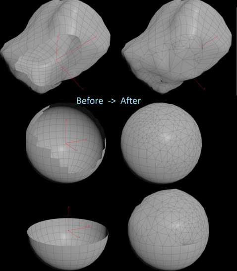

# Implementation of 3D reparation and hole-filling for meshes in Houdini

An artist-centered tool for the repair of high resolution meshes. Currently an extension of the research papers, 
[A Fast Hole-Filling Method for Triangular Mesh in Additive Repair, Chao Feng, Jin Liang, Maodong Ren, Gen Qiao, Wang Lu, Shifan Liu](https://www.mdpi.com/2076-3417/10/3/969/htm)
, [Texture Inpainting Using Efficient Gaussian Conditional Simulation, Bruno Galerne, Arthur Leclaire](https://hal.archives-ouvertes.fr/hal-01428428/document)
and [Filling Holes in 3D Meshes using Image Restoration Algorithms](https://www.researchgate.net/publication/242075854_Filling_Holes_in_3D_Meshes_using_Image_Restoration_Algorithms).
These are combined with a Houdini Digital Asset, making a user-friendly, integrated plugin for Mesh Reparation.

## Description
This tool lets you repair 3D meshes with holes in them. Such holes are filled with coherent, context-aware new patches that are correct in both topology and microsurface detail.
Full documentation is available [here](https://docs.google.com/document/d/1TPdwAJdjdkAw7thj_juBrT3CsDIIpejhfAMrlIvgXWg/edit?usp=sharing).

## Results (Topological Repair)

## Development
### Current Progress: WIP
This project is continuing its development into 2021 as part of Imperial College's Final Year Research Project. Track its development [here](https://docs.google.com/document/d/1W57TaN7dySTvUMGle7FJrFnn1WMlSTkTAApxI4g-pWM/edit?usp=sharing).
