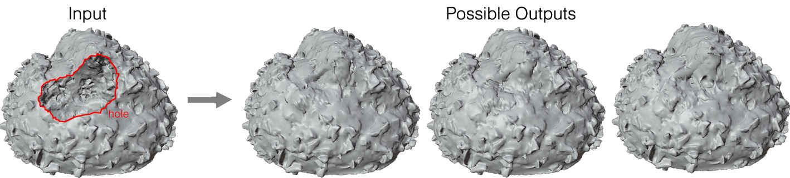

# ASMR: Automatic Surface Mesh Repairer, a tool for 3D hole filling and mesh correction in Houdini
<b><a href="https://drive.google.com/file/d/1hyhO3JteqJMAyyn_9l-NreiBx2BUwKNA/view" target="_blank">[Internal Report]</a></b>
  
An artist-centered tool to repair meshes with holes. Such holes are filled with coherent, context-aware new patches with correct topology and microsurface detail. This tool is packaged as a Houdini Digital Asset, making a user-friendly, integrated plugin for Mesh Reparation. 

## Description
This tool is capable of repairing holes in polygonal meshes. It uses a two-pass pipeline to first restore the missing shape (low-frequency topology) and to then restore the missing surface detail (high-frequency microsurface detail). The seperability of the low-frequency and high-frequency passes means users can pick their ideal underlying shape and surface detail. It also means users can elect to do only the low-frequency pass to repair low resolution meshes. The result of this process is a mesh that is watertight, manifold and whose repaired surface blends well with the original mesh.

### Low-Frequency Pass
Users can select their ideal hole-filling method in the "Low Frequency" tab. This tool categorizes holes into Small(<=8 hole boundary points>), Medium (<8 to <=20 hole boundary points) and Large(> 20 hole boundary points),  with a different selection of available algorithms for each. This is because some algorithms better suit the characteristics of certain hole categories. The algorithms mentioned are based on or extended off of the research papers, [A Fast Hole-Filling Method for Triangular Mesh in Additive Repair, Chao Feng, Jin Liang, Maodong Ren, Gen Qiao, Wang Lu, Shifan Liu](https://www.mdpi.com/2076-3417/10/3/969/htm), [Filling holes on locally smooth surfacesreconstructed from point clouds, Jianning Wang, Manuel M. Oliveria](https://www.inf.ufrgs.br/~oliveira/pubs_files/FHPC/Wang_Oliveira_Filling%20Holes%20on%20Locally%20Smooth%20Surfaces_Imavis_2007_Pre-print.pdf) and [Island Hole Automatic Filling Algorithm in Triangular Meshes, Feng Long Bi, Ying Hu, Xin Yu Chen, Yue Ma](https://www.scientific.net/AMM.347-350.3486).

#### Small Holes
Small Holes can be repaired by either MCT (Minimmum Cost Triangulation) or Centroid algorithms. We recommend MCT as it is less prone to creating degenerate faces.

#### Medium Holes
Medium Holes can be repaired by the MCT with MRF (Mesh Refinement and Fairing) algorithm.

#### Large Holes
Large Holes can be repaired by either the Improved AFT (Advancing Front Triangulation) or MLS (Moving Least Squares) with MCT. We recommend MLS with MCT if you are repairing a high resolution mesh that needs the high-frequency pass, as it is a more stable algorithm that scales better with poly count. It is recommended you reduce the "density" parametrization of the patch to around 0.05 of the original mesh's point density, to negate the 20-fold increase in patch-density by the high-frequency pass. 

We recommend Improved AFT if you are repairing a low resolution mesh that does not need the high-frequency pass, as you can control the topology of the restored curve with the "alpha:beta" parametrization. The generated hole patch has a rounder topology as "alpha:beta" -> 1, and a flatter topology as "alpha:beta" -> 0. 

### High-Frequency Pass
Users can generate their ideal surface detail in the "High Frequency" tab. The high-frequency pass is an extension of the research papers, [Deep Geometric Texture Synthesis, Amir Hertz, Rana Hanocka, Raja Giryes, Daniel Cohen-Or](https://arxiv.org/pdf/2007.00074.pdf) and [Progressive Gap Closing for Mesh Repairing, Pavel Borodin, Marcin Novotni, Reinhard Klein](https://cg.cs.uni-bonn.de/en/publications/paper-details/borodin-2002-progressive/). To do high-frequency passes, you must have downloaded my forked repository for geometric synthesization, [geometric textures](https://github.com/Ozeuth/geometric-textures). 

## Installation
While you are welcome to install this to test out, we recommend waiting until the installation process is more streamlined, eta July 2021.
1. Ensure you have Houdini with Python 3 installed. If not, [download](https://www.sidefx.com/download/daily-builds/?production=true&python3=true) it
   * You do not need the commercial version
2. Install the following packages (numba, hausdorff) on Houdini's Python 3.
   

Pip Installation

   1. Download `get-pip.py` from [bootstrap.pypa.io](https://bootstrap.pypa.io/get-pip.py).
   2. Place `get-pip.py` into Houdini's python37 folder. For example, this could be `C:\Program Files\Side Effects Software\Houdini_VERSION\python37` on Windows
   3. Use Houdini's python3.7 to install pip: `PATH_TO_PYTHON\PYTHON PATH_TO_GET_PIP\get-pip.py`. For example, this could be `C:\Program Files\Side Effects Software\Houdini_VERSION\python37\python3.7.exe C:\Program Files\Side Effects Software\Houdini_VERSION\python37\get-pip.py` on Windows. If successful, `pip.exe` will appear in your `\Scripts` folder.
   

Package Installation

   1. Use Houdini's pip to install the package for hausdorff distance:  `PATH_TO_PYTHON\PYTHON -m PATH_TO_PIP\pip install hausdorff`. For example, this could be `C:\Program Files\Side Effects Software\Houdini_VERSION\python37\python3.7.exe -m C:\Program Files\Side Effects Software\Houdini_VERSION\python37\Scripts\pip install numba hausdorff` on Windows. If successful, `numba` and `hausdorff` will appear as folders in `\lib\site-packages`
   

3. Install the [High-Frequency Pass Synthesizer](https://github.com/Ozeuth/geometric-textures).
   

Windows Users

   1. Install [WSL 2 for Windows](https://docs.microsoft.com/en-us/windows/wsl/install-win10)
   2. Install [NVIDIA CUDA drivers for Windows WSL](https://docs.nvidia.com/cuda/wsl-user-guide/index.html)
   3. Install the following packages (pytorch, numpy, faiss-gpu, matplotlib, pillow) on WSL's Python 3: `pip install pytorch numpy faiss-gpu matplotlib pillow`
   4. Open the command prompt and download our synthesizer into WSL: `git clone https://github.com/Ozeuth/geometric-textures.git`
   

Linux Users

   1. Install [Nvidia CUDA drivers](https://developer.nvidia.com/cuda-downloads)
   2. Install the following packages (pytorch, numpy, faiss-gpu, matplotlib, pillow) on either Houdini's or your independent version of Python 3: `pip install pytorch numpy faiss-gpu matplotlib pillow`
   3. Open the command prompt and download our synthesizer: `git clone https://github.com/Ozeuth/geometric-textures.git`
   

4. Open the command prompt and download our code: `git clone https://github.com/Ozeuth/Houdini-Plugin-For-Mesh-Reparation.git`

## Development
### Current Progress: WIP
This project is continuing its development into 2021 as part of Imperial College's Final Year Research Project. 
